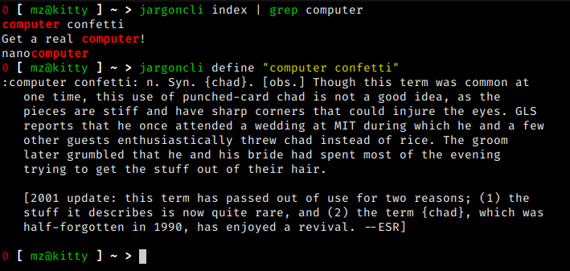

# Jargoncli, a terminal Jargon file viewer



## Installation

Run ``cargo install --path .`` in the root of the git repo.

The binary will be installed to ``~/.cargo/bin`` you may have to source ``~/.cargo/env`` to use it.

It is recommended to copy the ``jargon447`` file to the default path of ``/usr/local/share/jargon``.

## Usage

```
jargoncli [file path/to/jargon/file] [define wordtodefine] [index]
	
	file: Jargon file location
	define: Print a word's entry in the file
	index: Output a list of entrys
```

## Updating the file

You can download text versions of the file from http://www.catb.org/jargon/oldversions/.

The file seems to contain invalid UTF-8, which can be removed with iconv:

```
iconv -f utf8 -t utf8//IGNORE < jargonfile > jargonwithvalidunicode
```
